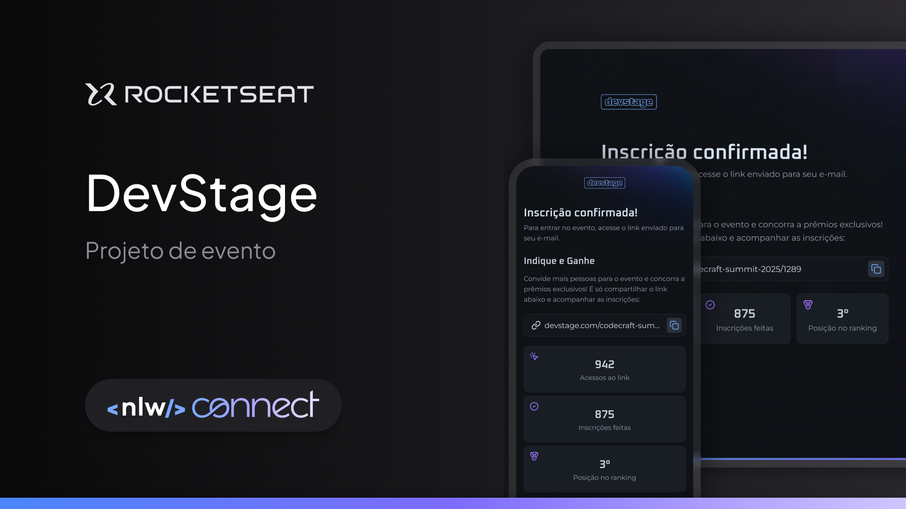

  <h1 align="center">
	DevStage 🚀
  </h1>
  <h5 align="left">
	  🚀 Boas-vindas ao projeto.
  </h5>
  <h5 align="left">
	  Essa aplicação foi desenvolvida durante uma NLW da Rocketseat.
  </h5>
  <h5 align="left">
	  O projeto é um site responsivo de inscrição e indicação para eventos.
    Esse é um projeto do evento NLW Connect, um dos conteúdos disponíveis para alunos da Rocketseat.
  </h5>

# Tabela de conteúdos

- [Funcionalidades](#features)
- [Tecnologias](#technologies)

## Tecnologias

  <h2>Essa aplicação foi desenvolvida com as seguintes tecnologias:</h2>
  
  - [Java](https://dev.java/learn/)
  - [Maeven](https://maven.apache.org/guides/index.html)
  - [Sprint](https://docs.spring.io/spring-framework/reference/index.html)
  - [MySQL](https://dev.mysql.com/doc/)
  - [Python](https://docs.python.org/)
  - [Pytest](https://pytest.org/)
  - [SQLAlchemy](https://docs.sqlalchemy.org/)
  - [Flask](https://flask.palletsprojects.com/)
  - [ReactJS](https://pt-br.reactjs.org/)
  - [ViteJS](https://vitejs.dev/)
  - [TypeScript](https://www.typescriptlang.org/)
  - [TailwindCSS](https://tailwindcss.com.com/)

  <h2>Features</h2>
  
    - [x] Criar evento
    - [x] Buscar evento
    - [x] Gerar link de inscrição
    - [x] Faz inscrição em um evento

  <h2>Motivação</h2>
  
Durante o evento da NWL, decidi me inscrever em 4 trilhas.

  
Python: Porque queria me atualizar com a linguagem e aprender coisas novas.
    Pude rever conceitos de código limpo, arquitetura, pude aprender sobre testes em python.

    
Java: Nunca tinha feito nada em Javs, descidi me inscrever para ter a experiência com a linguagem.
    Gostei muito e pretendo seguir com o estudo da linguagem.

    
ReactJS: Já trabalho a mais de 3 anos com React, mas sempre que participo aprendo algo novo e nem sempre
    é código, mas aprendizados sobre melhores formas de se construir algo, arquitetura, estrutura de projeto, etc.

    
NodeJS: Já construi aplicações com NodeJS, mas pretendendo continuar aprendendo e vi na NLW uma forma de dar
    uma passa a mais com Node.
    

  <h2>Autor</h2>

 
  
 <b>Flavio Santos</b>

Built with ❤️ by Flavio Santos 👋🏽 get in touch!

